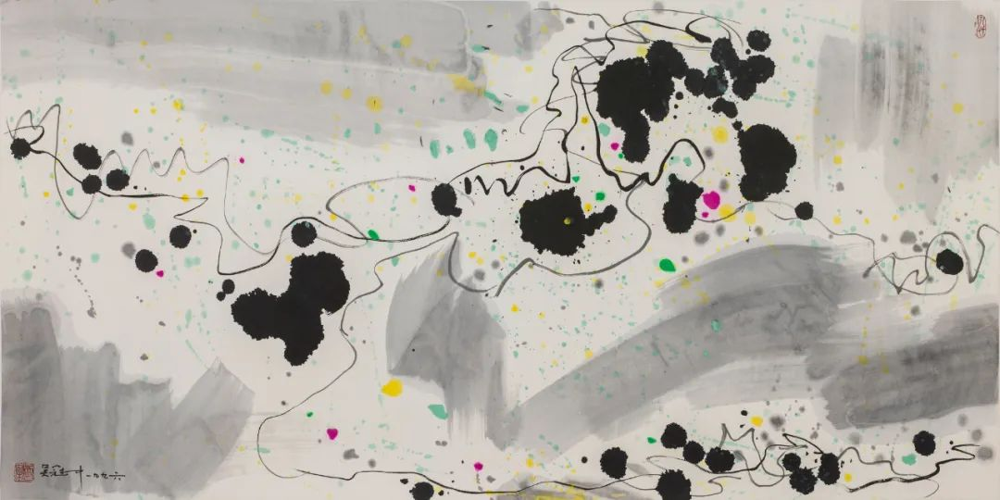

Welcome to my homepage!

My name is Haoen Li (李昊恩, [pronunciation](https://translate.google.com/?sl=auto&tl=en&text=%E6%9D%8E%E6%98%8A%E6%81%A9&op=translate)). I am currently a [graduate student](https://math.berkeley.edu/people/graduate-students) in [Department of Mathematics, University of California, Berkeley](https://math.berkeley.edu/). I am fortunate to be supervised by Professor [Lin Lin](https://math.berkeley.edu/~linlin/).

**Office:** 854 Evans Hall

**Email:** ``haoen2021 (at) math (dot) berkeley (dot) edu``

**[Read More](about.md)**

**[Google Scholar](https://scholar.google.com/citations?user=vIwrc6AAAAAJ&hl=en-US)**

**[Research](pubs.md)**

> 

>
> 
 吴冠中《雪山》（1996）

>
> 
 登高壮观天地间，大江茫茫去不还。黄云万里动风色，白波九道流雪山。

> 
——【唐】李白《庐山谣寄卢侍御虚舟》

