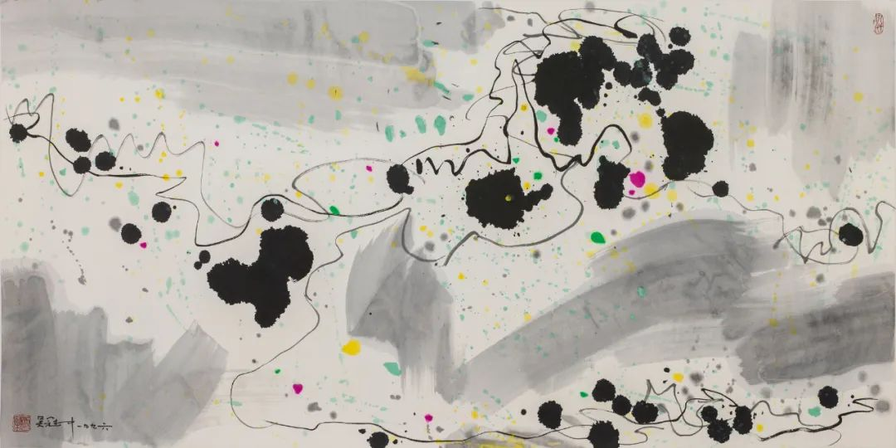

Hey there! Welcome to my homepage. Take a peek around!

## About me

My name is Haoen Li (李昊恩). I am now a junior undergraduate student at Dept. of Chemistry, Tsinghua University.

E-mail:

`lhe21 (at) mails (dot) tsinghua (dot) edu (dot) cn`

``haoenli2021 (at) gmail (dot) com``

**See the [About](about.md) module to know more about me or see my [curriculum vitae](documents/CV.pdf) for detailed information.**

**[Google Scholar](https://scholar.google.com/citations?user=vIwrc6AAAAAJ&hl=zh-CN)**

## Education

- (2021.9-2025.6, expected) B.Sc. in **Chemistry** and B.Sc. in **Pure and Applied Mathematics** (as secondary major), **Tsinghua University** (advisor: [Han-Shi Hu](https://scholar.google.com/citations?user=W2sG5oEAAAAJ&hl=en))

## Research Interests

**Quantum Chemistry and Electronic Structure Theory**: Wave function methods; Quantum many-body physics; Quantum algorithms for science; Theory of quantum information & computing;

> 

>
> 
吴冠中，《雪山》（1996），清华大学艺术博物馆藏

>
> 
登高壮观天地间，大江茫茫去不还。
> 

黄云万里动风色，白波九道流雪山。

